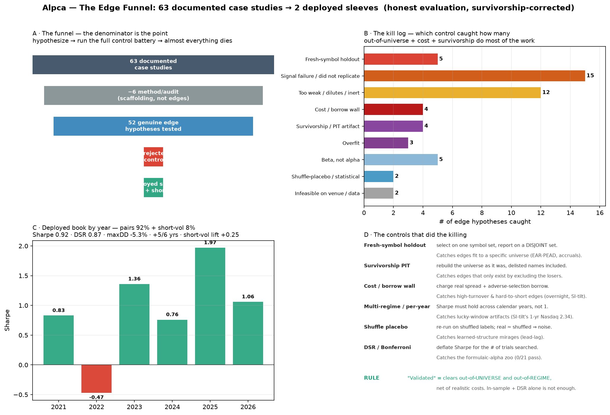
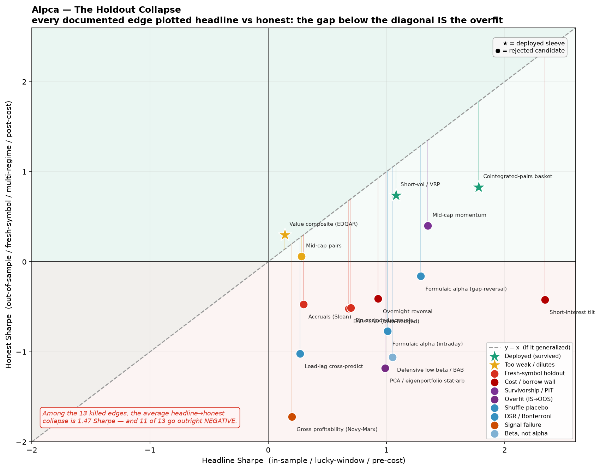
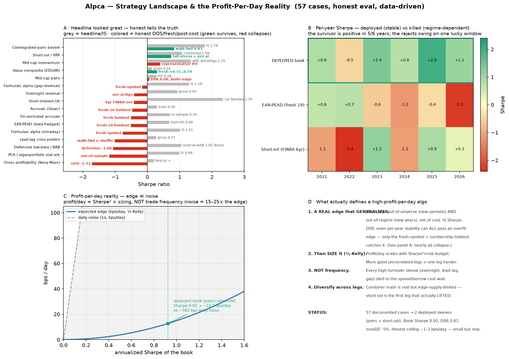
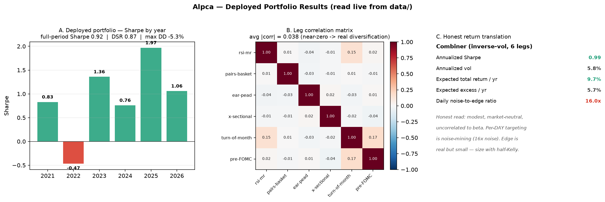

# Alpca — a latency-aware Alpaca paper bot **and an honest strategy-evaluation platform**

A runnable Alpaca **paper**-trading system with realistic execution modeling, a 34-strategy
library, autonomous scheduled jobs — and, most importantly, a **rigorous, self-honest
evaluation harness** that judges every strategy against buy-and-hold, for statistical
significance, regime stability, and out-of-sample/walk-forward performance.

The harness is the point. It exists because it's trivially easy to produce a beautiful
backtest and fool yourself; this system is built to *not*.

## The honest findings (read this first)

We tested every price-only equity strategy family rigorously. The consistent result:

- **No strategy beats buy-and-hold.** Across 34 strategies on 5 years of daily data, the
  best returns are ~half the market's with lower drawdown — that's **beta (risk-reduced
  market exposure), not alpha.** (`scripts/truth_table.py` → GENUINE market-beaters: **none**.)
- **On 1-minute bars everything bleeds** to transaction costs (overtrading). Faster ≠ better.
- **HFT is structurally infeasible** on this venue (~1.2s measured fills, IEX top-of-book
  only, no maker rebates). The latency instrumentation is for *execution-quality measurement*,
  not HFT alpha.
- **Market-neutral pairs** is the one real equity edge. The over-diversified basket collapsed
  out-of-sample (0.29), but the **concentrated form** (top-10 + 5% ADF cointegration screen)
  holds at **walk-forward Sharpe ~0.83, −5% drawdown**, and — critically — **survives a
  survivorship-corrected point-in-time re-test** (Case 46). It runs on a forward paper-track.
- **Short-vol / variance-risk-premium** is the second deployed sleeve: the first leg that
  actually *lifted* the book (+0.25) and **survives a simulated volmageddon** at an 8% cap (Cases 49–50).
- **Everything else collapsed** under out-of-universe / out-of-regime / cost holdouts — see the
  funnel below. EAR-PEAD, short-interest tilt, accruals, the Alpha101/158/191 zoo, overnight
  reversal: all looked great in-sample, none generalized.

The deployable book is honest and modest: **pairs (~92%) + short-vol (~8%)**, full-period
**Sharpe ~0.92, DSR ~0.87, max DD ~−5%, positive in 5 of 6 years** — market-neutral, uncorrelated
to beta, real because of everything it had to survive. The honest ceiling is ~1–2 bps/day at
half-Kelly. See `docs/STATE_OF_THE_PROGRAM.docx` and `docs/VERIFICATION_CONTROLS.md`.

## Results at a glance

The denominator is the point: **57 documented case studies → 2 deployed sleeves.** Four graphics
tell the whole story (regenerate any with `.venv/bin/python scripts/plot_*.py`):

| Graphic | What it shows |
|---|---|
|  | **`docs/edge_funnel.png`** — every case classified by the control that killed it, down to the 2 survivors |
|  | **`docs/holdout_collapse.png`** — headline vs honest Sharpe for every edge; the gap below the diagonal *is* the overfit |
|  | **`docs/strategy_landscape.png`** — the overfit catch + per-year regime stability + the profit-per-day reality |
|  | **`docs/deployed_results.png`** — the live book: per-year Sharpe + near-zero leg correlations |

Full write-ups: `docs/VERIFICATION_CONTROLS.md` (the anti-overfit machinery) and
`docs/EDGE_CASE_STUDIES.md` (all 57 cases) · `docs/Alpca_Discovery_and_HFT_Assessment.docx`.

## What's in the box

```
alpca/
  config.py / envfile.py     PAPER by default; live double-gated; creds from env only
  strategies/                34 strategies across families, name->factory registry:
    breakout.py              Donchian, ORB, Keltner, Supertrend
    mean_reversion.py        Z-score, Wilder-RSI mean-reversion (+ vol gate)
    momentum.py              EMA cross, MACD, RSI-momentum, ATR-breakout, Bollinger
                             expansion, VolRegimeGate, ADXTrendGate, EnsembleVote
    intraday.py              VWAP reclaim/reject, session momentum
    microstructure.py / order_flow.py   microprice gate, L1 OFI (NBBO)
    council.py               TradeCouncil — advocates + skeptics under one voice
  execution/                 realistic fills (spread/impact/partials/queue), fees, latency,
                             order lifecycle + hash-chained ledger, risk-gated router,
                             Alpaca + Sim adapters, calibrated fill model
  risk/risk_engine.py        pre-trade gates (notional/loss/concentration/short/rate, finite-guarded)
  runtime/                   signed-position runner, T+1 settlement, PDT, borrow fees
  backtest/
    engine.py                no-look-ahead backtester + metrics
    evaluation.py            *** THE HARNESS *** — vs B&H, Sharpe significance (t-stat/p),
                             regime stability, Sortino/Calmar, beta/alpha/info-ratio, OOS
    pairs.py                 market-neutral pairs: ADF cointegration, Kalman hedge, walk-forward
    cross_sectional.py       cross-sectional momentum / reversal (market-neutral)
    parity.py                backtest-vs-live parity + TCA decomposition
  data/, metrics/, calibration/   bars/quotes, calendar, latency, fill-model calibration
scripts/
  truth_table.py             run the whole registry through the harness -> ranked verdicts
  discover_universe.py       cointegration-screen a universe; basket + OOS + walk-forward
  discover_strategies.py     sweep strategies x symbols x timeframes
  run_live_session.py        hardened live PAPER session (RTH-gated, flatten on start/exit)
  run_calibration_pipeline.py  calibrate the fill model to real paper fills
tests/   3300+ offline tests (no credentials, no network)
```

## Setup

```bash
python3 -m venv .venv && source .venv/bin/activate
pip install -e .
cp .env.example .env          # fill ALPACA_API_KEY / ALPACA_SECRET_KEY (paper)
```

## Use the harness (the valuable part)

```bash
# Judge one strategy honestly (vs buy-and-hold, significance, stability, OOS):
python -c "import json; from alpca.backtest.evaluation import evaluate; \
  bars=[json.loads(l) for l in open('data/cache/SPY_1day_bars.jsonl')]; \
  print(evaluate('rsi-mr', bars).render())"

# Run the whole registry -> the truth table:
python scripts/truth_table.py --symbol SPY --timeframe 1day --cache data/cache

# Market-neutral discovery on a universe (basket + out-of-sample + walk-forward):
python scripts/discover_universe.py --cache data/cache
```

## Run the bot

```bash
python scripts/run_live_session.py --strategy donchian --symbol SPY --dry-run   # no orders
python scripts/run_calibration_pipeline.py --symbol SPY --cycles 16             # at the open
```

## Autonomous jobs (macOS launchd, paper only)

- `com.alpca.calibration` — Mon–Fri 09:36 ET: calibrate the fill model to real fills.
- `com.alpca.livesession` — Mon–Fri 09:50 ET: a hardened live paper session (donchian-adx).
- `com.alpca.discovery` — Fri 17:30 ET: re-run market-neutral discovery (research only).

Disable any: `launchctl bootout gui/$(id -u)/com.alpca.<name>`.

## Safety

- **PAPER by default.** Live needs `ALPACA_PAPER=0` **and** `ALPACA_LIVE_CONFIRMED=I_UNDERSTAND`.
- Every order passes the pre-trade `RiskEngine` before any broker call. Live sessions flatten
  on startup and exit and self-halt on a daily-loss breach.
- Credentials live only in `.env` (gitignored, never committed) and are never logged.
